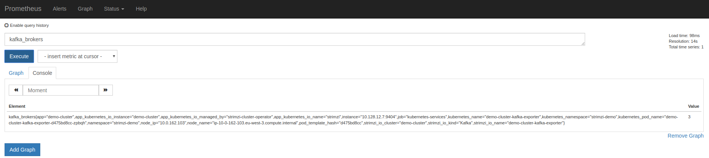
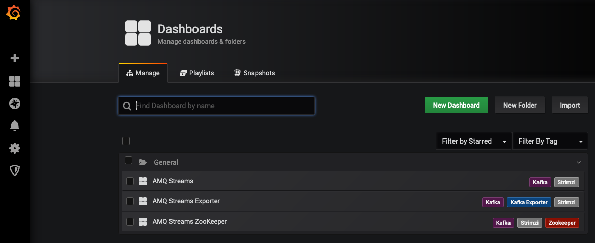
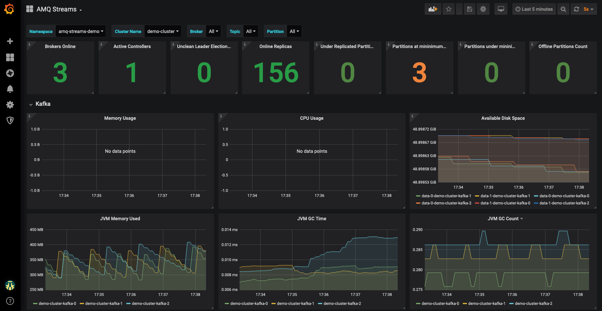
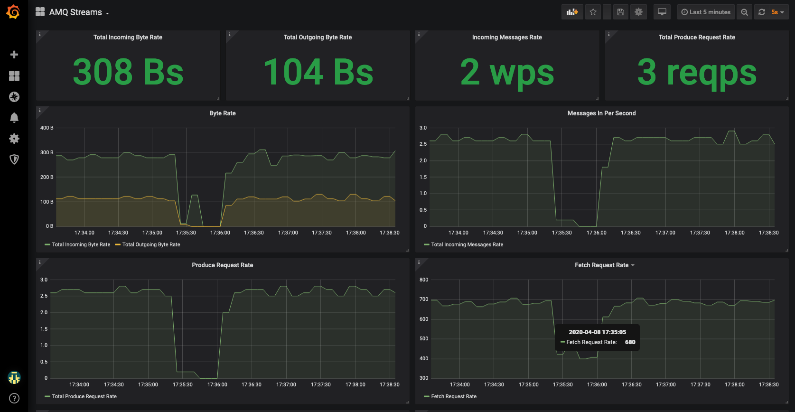
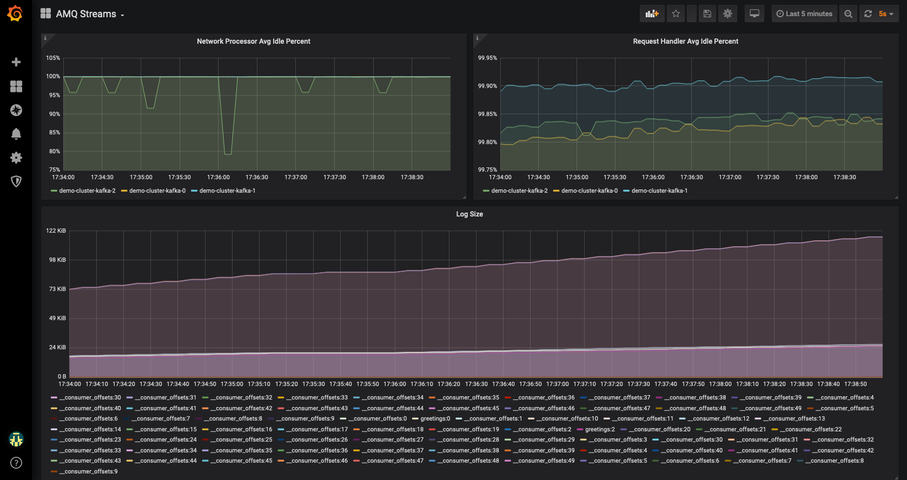
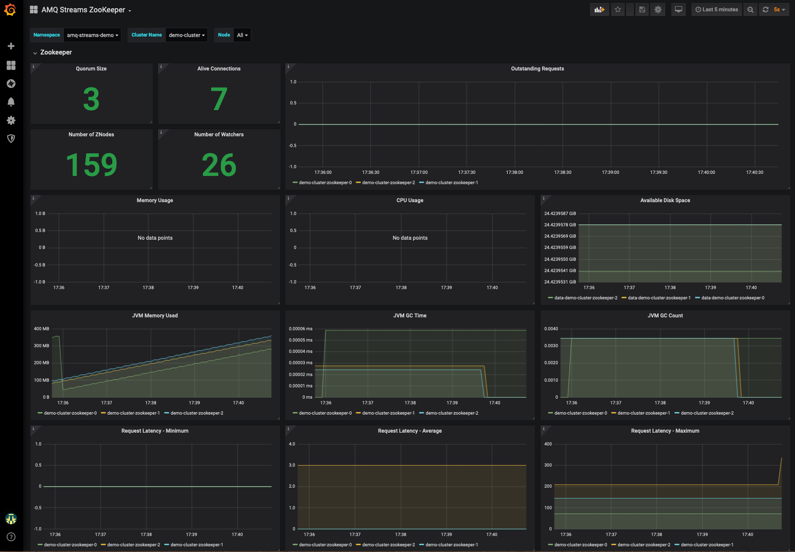
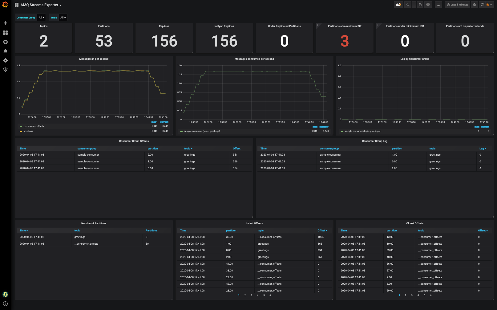

# Red Hat AMQ Streams Demo
Red Hat AMQ Streams Operator with OpenShift

This repos will demo the [Red Hat AMQ](https://www.redhat.com/en/technologies/jboss-middleware/amq) using [Red Hat AMQ Streams Operator](https://access.redhat.com/documentation/en-us/red_hat_amq/7.6/html-single/using_amq_streams_on_openshift/index#key-features-operators_str).

Red Hat AMQ Streams provides a way to run an [Apache Kafka](https://kafka.apache.org/) cluster on [OpenShift](https://www.openshift.com/) in various deployment configurations. See the Red Hat AMQ [website](https://access.redhat.com/products/red-hat-amq) for more details about the project.

The Red Hat AMQ Streams cluster will expose metrics to Prometheus and
Grafana dashboards managed by:
* [Prometheus Operator](https://operatorhub.io/operator/prometheus): This operator creates and manages Prometheus
instances to monitor services in a namespace.
* [Grafana Operator](https://operatorhub.io/operator/grafana-operator): This operator creates and manages
Grafana instances, import Grafana datasources and import Grafana Dashboards.

## Environment

This demo has been tested in the following environment
* Red Hat OpenShift Container Platform v4.3.9
* Red Hat AMQ Streams v1.4.0
* Grafana Operator v 2.0.0
* Prometheus Operator v0.32.0

This version has deployed the Operator Lifecycle Manager (OLM), tool to help manage the
Operators running on a cluster.

## Prerequisite

Ensure that the following exists
* Properly configured and working OpenShift Cluster
* Admin Cluster User with ```cluster-admin``` role
* Normal Cluster User

## Create a New Project

As a normal user, create a ```amq-streams-demo``` project:

```bash
oc login -u user
oc new-project amq-streams-demo
```

You may also create the project via the web console by following the instructions [here](https://docs.openshift.com/container-platform/4.3/applications/projects/working-with-projects.html#creating-a-project-using-the-web-console_projects)

## Deploy Red Hat AMQ Streams Operator

1. Login as the admin user.
1. Install the AMQ Streams Operator by following the instructions [here](https://access.redhat.com/documentation/en-us/red_hat_amq/7.6/html-single/using_amq_streams_on_openshift/index#proc-deploying-cluster-operator-hub-str)

    **NOTE:** Install the AMQ Streams Operator to all (projects) namespaces so that it will be usable from any namespaces in the cluster.

## Create Operator Group

To deploy Prometheus and Grafana Operators, we need to first install an OperatorGroup to match the Operator's installation mode and the namespace. This step is describe in [Adding Operators to a cluster](https://docs.openshift.com/container-platform/4.3/operators/olm-adding-operators-to-cluster.html) page from
[OpenShift 4.3 Documentation](https://docs.openshift.com/container-platform/4.3/welcome/index.html) site

```bash
oc login -u admin-user
oc apply -f 01-operator-group.yaml
```

## Deploy Prometheus and Grafana Operators via Web Console

This demo will use [Prometheus Operator](https://operatorhub.io/operator/prometheus) and
[Grafana Operator](https://operatorhub.io/operator/grafana-operator) to deploy them and monitor the AMQ Streams ecosystem easily.

### Login to the Web Console and select the project
1. **Login** to the web console as the `admin-user`
1. **Select** the ```amq-streams-demo``` project (*Home -> Projects -> amq-streams-demo*)

### Installing Prometheus Operator
1. **Naviate** to the OperatorHub (*Operators -> OperatorHub*)
1. **Type** `prometheus` in the *Filter by keyword*
1. **Select** on the `Prometheus Operator`
1. **Review** the Community Operator notice, and **click** `Continue`
1. **Click** Install
1. **Review** the default options, and **click** `Subscribe`

### Installing Grafana Operator
1. **Naviate** to the OperatorHub (*Operators -> OperatorHub*)
1. **Type** `grafana` in the *Filter by keyword*
1. **Select** on the `Grafana Operator`
1. **Review** the Community Operator notice, and **click** `Continue`
1. **Click** Install
1. **Review** the default options, and **click** `Subscribe`

After several minutes we could check these operators are installed and availables:

```bash
$ oc get csv
NAME                        DISPLAY                             VERSION   REPLACES                    PHASE
amqstreams.v1.4.0           Red Hat Integration - AMQ Streams   1.4.0     amqstreams.v1.3.0           Succeeded
grafana-operator.v2.0.0     Grafana Operator                    2.0.0     grafana-operator.v1.3.0     Succeeded
prometheusoperator.0.32.0   Prometheus Operator                 0.32.0    prometheusoperator.0.27.0   Succeeded
```

Prometheus JMX exporter converts the JMX metrics supported by Apache Kafka and Apache Zookeeper to Prometheus metrics. This feature helps us to monitor the cluster
easily using Prometheus to store the metrics and Grafana Dashboards to expose them.

To get detailed configuration, please, review the [Appendix C: Metrics](https://strimzi.io/docs/latest/#assembly-metrics-setup-str) from Strimzi Documentation site.

## Deploy Metrics Platform

Prometheus and Grafana Operator help us to deploy our local Prometheus Server and Grafana instance where
we could manage the metrics from our AMQ Streams Cluster.

Ensure that you're still logged in as the `admin-user` in the correct project:

```bash
oc login -u admin-user
oc project amq-streams-demo
```

### Prometheus Deployment

Deploy a local Prometheus Server as follows:
```bash
oc create secret generic additional-scrape-configs --from-file=prometheus-additional.yaml

oc apply -f 02-prometheus-metrics
```

A Prometheus instance will be available with a service and a route:

```bash
$ oc get svc
NAME                  TYPE        CLUSTER-IP       EXTERNAL-IP   PORT(S)    AGE
prometheus            ClusterIP   172.30.235.132   <none>        9090/TCP   4h
prometheus-operated   ClusterIP   None             <none>        9090/TCP   4h

$ oc get route prometheus -o jsonpath='{.spec.host}'
prometheus-amq-streams-demo.apps.myocp.mydomain.com
```

The Prometheus Dashboard will look something like this:



### Grafana Deployment

Deploy Grafana as follows:

```bash
oc apply -f 03-grafana.yaml
```

Grafana will deploy a Datasource connected to the Prometheus server available by Promtheus in the endpoint ```http://prometheus-operated:9090```. The Grafana Server will use that Datasource to get the metrics. Grafana has a set of dashboards to review the metrics from Apache Zookeeper and AMQ Streams Cluster. 

Setup the Grafana Dashboard:

```bash
oc apply -f 04-grafana-dashboard
```

Get the Grafana route:

```bash
oc get route grafana-route -o jsonpath='{.spec.host}'
```

**NOTE:** Use the original credentials **root/secret** as user/password. These credentials are defined in the [Grafana CR](./03-grafana.yaml) file. Also, **wait a few minutes** for Grafan to finish its deployment.

Grafana Dashaboards will be displayed in Grafana as:



## Deploy and use a AMQ Streams Cluster

We'll change to use a non-cluster-admin user to deploy our metrics platform.

```bash
oc login -u user
```

### Deploy Kafka Cluster

AMQ Streams cluster is deployed using the custom resource in [kafka-cluster.yaml](./05-kafka-cluster.yaml) file:

```bash
oc create -f 05-kafka-cluster.yaml
```

**NOTE:** This will take around **5 minutes** to complete.  You can watch the process by doing a `watch oc get pod`

The AMQ Streams Cluster will be deployed with the following set of pods:

```bash
$ oc get pod
NAME                                            READY     STATUS    RESTARTS   AGE
demo-cluster-entity-operator-789556fbdd-bwk54   3/3       Running   0          7h
demo-cluster-kafka-0                            2/2       Running   0          7h
demo-cluster-kafka-1                            2/2       Running   0          7h
demo-cluster-kafka-2                            2/2       Running   0          7h
demo-cluster-zookeeper-0                        2/2       Running   0          7h
demo-cluster-zookeeper-1                        2/2       Running   0          7h
demo-cluster-zookeeper-2                        2/2       Running   0          7h
...
```

## Deploy Kafka Topic

A Kafka Topic is created using the custom resource in [kafka-topic.yaml](./06-kafka-topic.yaml) file:

```bash
oc create -f 06-kafka-topic.yaml
```

This custom resurce will create the topic ```greetings```:

```bash
$ oc get kafkatopic
NAME       PARTITIONS   REPLICATION FACTOR
greetings  3            2
```

## Deploy Producer and Consumer

To test the AMQ Streams cluster, we will deploy jobs to produce and consume messages using the plain connection protocol:

This producer will send a set of messages to the topic ```greetings```:

```bash
oc create -f 07-job-producer.yaml
```

This consumer will consume messages from each partition of the ```greetings``` Topic:

```bash
oc create -f 08-job-consumer.yaml
```

You could check the status of the jobs or pods with the commands

```bash
$ oc get job
NAME                  COMPLETIONS   DURATION   AGE
sample-consumer-job   3/3           104s       115s
sample-producer-job   1/1           116s       2m7s
```

## Deploy Secured Producer and Consumer (optional)

To test the AMQ Streams cluster using the secured connection protocol run the SSL producer and consumer examples:

```bash
oc create -f sample-ssl-jobs/job-ssl-producer.yaml
oc create -f sample-ssl-jobs/job-ssl-consumer.yaml
```

## Grafana Dashboards

A sample of the Grafana AMQ Streams Dashboard when the consumers and producers are working would look as follows:





The Zookeeper Dashboard:



The AMQ Streams Exporter Dashboard:



[comment]: <> (This demo is adapted from https://github.com/rmarting/strimzi-demo)
